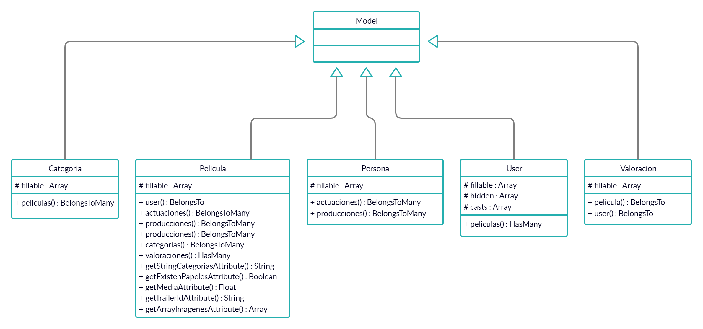
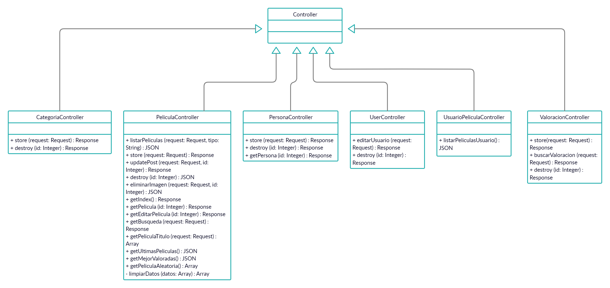
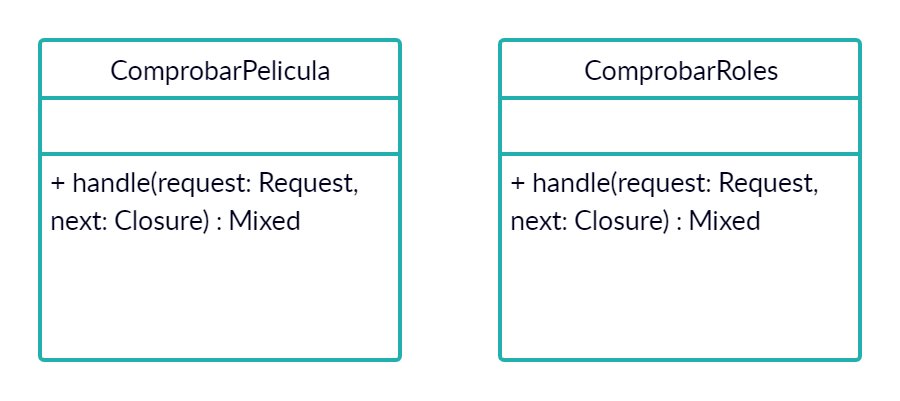
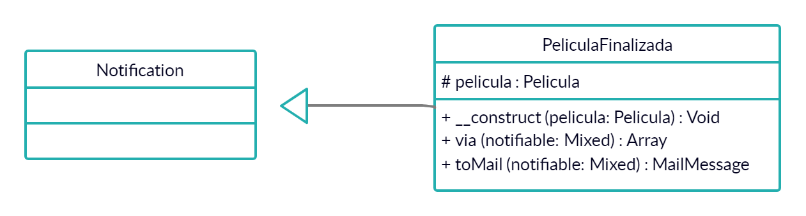
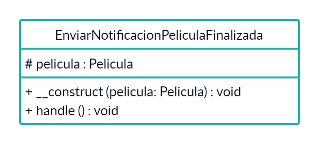
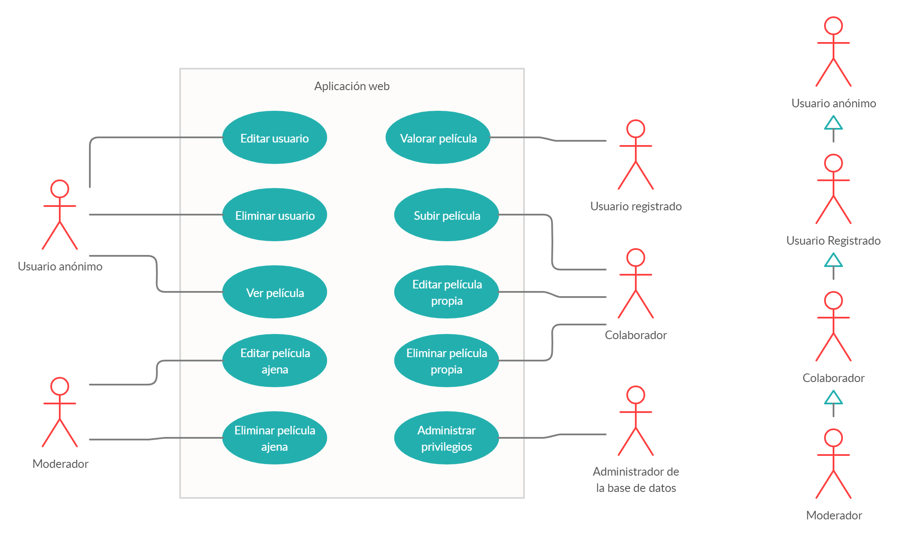
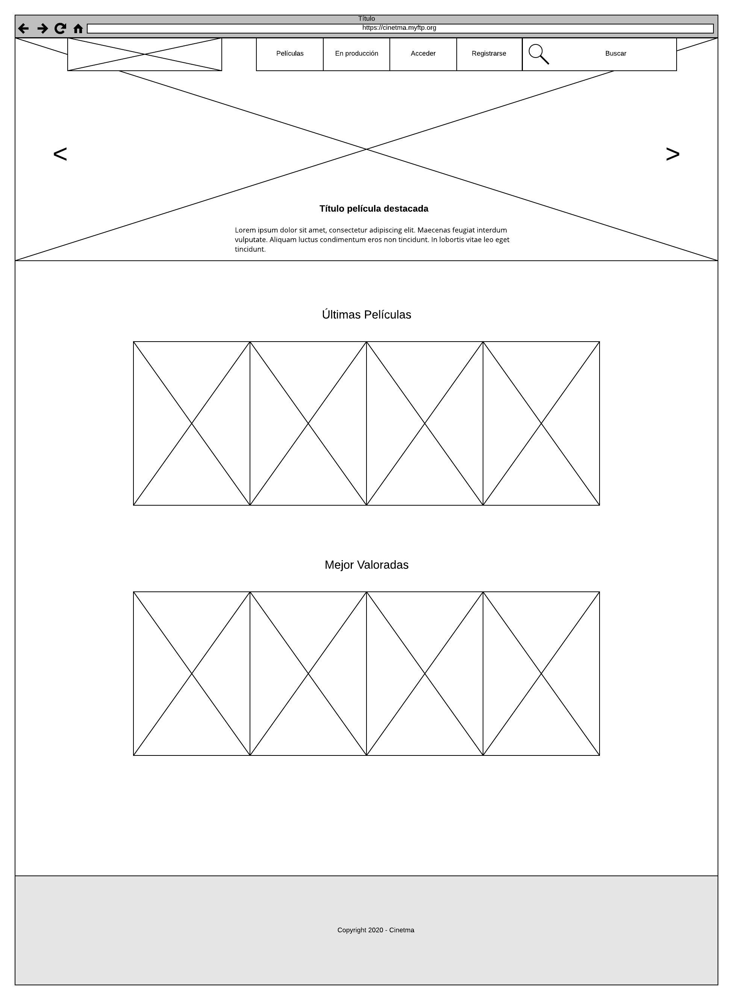
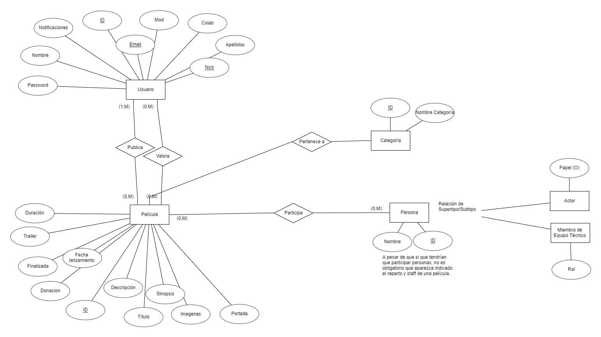
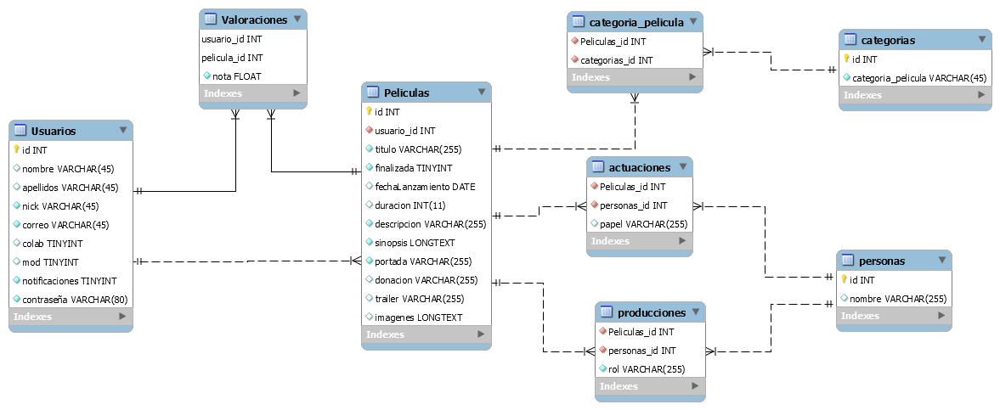

# Diseño

## Modelo conceptual do dominio da aplicación

Dado que el modelo conceptual resulta más complejo en Laravel, lo voy a distribuír en distintos apartados:

### Modelos

### Controllers

### Middelware

### Notificaciones

### Jobs

## Casos de uso

## Diseño de interface de usuarios

## Diagrama de Base de Datos.
Para este apartado van a ser necesarios dos tipos de diagramas distintos:

- Modelo Entidad/Relación
	+ 
- Modelo Relacional
	+ 